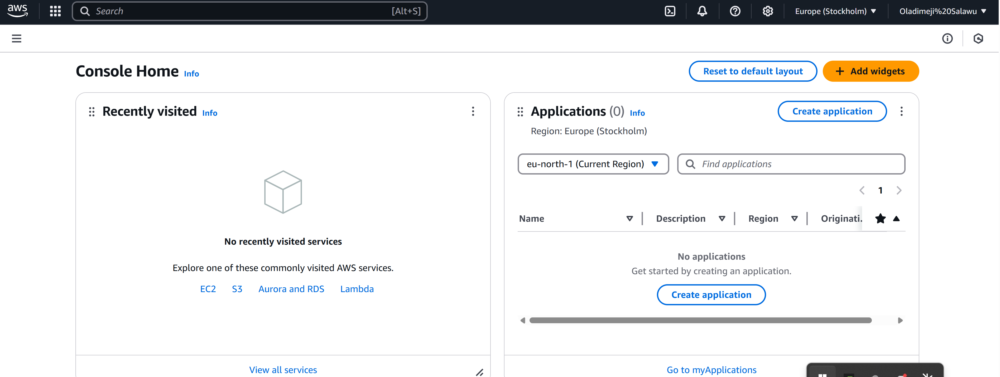

# Mini-Project-setting-up-DevOps-environment-3MTT
I have set up a demo of my installations on for a beginner DevOps Environment for beginners Windows users.


**TODO**
# DevOps Intro Setup Notes

## 1. Git Bash
- **Purpose**: Git CLI for version control.
- **Screenshot**: 

##Confirm Git Bash Installation
```
git --version
```

## 2. AWS Registration{S
- **Purpose**: Access AWS cloud services.
- **Screenshot**: 
- AWS Registration: [AWS Registration](https://aws.amazon.com/)


## 3. Visual Studio Code (VS Code)
- **Purpose**: Code editor for DevOps scripts and docs.
- **Screenshot**: 
- VS Code Download: [VS Code Download](https://code.visualstudio.com/)


## 4. Markdown
- **Purpose**: Documentation format.
- **Screenshot**: 
- Markdown Guide: [Markdown Guide](https://www.markdownguide.org/)


## 5. MobaXterm
- **Purpose**: Terminal for SSH and local access.
- **Screenshot**: 
- MobaXterm Download: [MobaXterm Download](https://mobaxterm.mobatek.net/download.html)


## 6. Ubuntu on Windows (WSL)
- **Purpose**: Linux environment for practice.
- **Screenshot**: 
- Ubuntu WSL Installation: [Ubuntu WSL Installation](https://ubuntu.com/wsl)
#Run this code to check installed version
```
wsl --set-version Ubuntu-20.04 2
```

## 7. Snipaste
- **Description**: Snipaste is a lightweight screenshot and annotation tool I use to capture and mark up images for documentation, streamlining my DevOps note-taking process.
- **Status**: Installed on Windows.
- **Screenshot**: 
- --Download from official website only.
- - **Download Link**: [Snipaste Download](https://www.snipaste.com/download.html)


- ###You wil should see a page like this.
- - **Screenshot**: 


##Code Example: CLI to capture a specific area (run in VS Code terminal)


```
"C:\Program Files\Snipaste\Snipaste.exe" snip --area 100 100 500 300
```


## 8. VirtualBox
- **Description**: VirtualBox is a virtualization tool that lets me run multiple operating systems (like Ubuntu) on my Windows machine, perfect for testing DevOps environments and configurations.
- **Status**: Installed with a sample VM.
- **Screenshot**: 
- --Download from official website only.

##Code Example: VBoxManage to create a VM (run in VS Code terminal)
```
"C:\Program Files\Oracle\VirtualBox\VBoxManage.exe" createvm --name "TestVM" --ostype Ubuntu_64 --register
"C:\Program Files\Oracle\VirtualBox\VBoxManage.exe" modifyvm "TestVM" --memory 2048 --cpus 2
```


